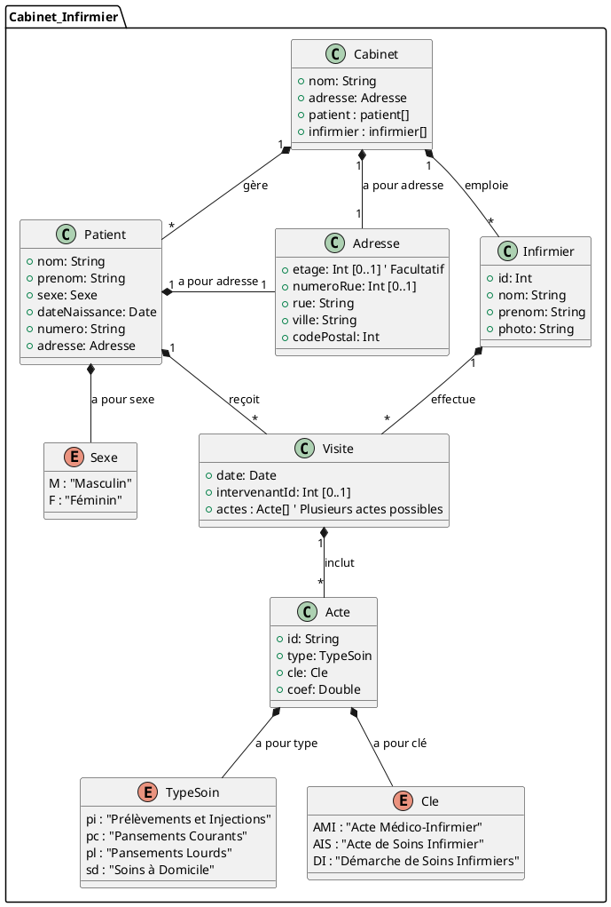

# mon rapport

```plantuml
@startuml
package Cabinet_Infirmier {

    ' Classe Cabinet
    class Cabinet {
        + nom: String
        + adresse: Adresse
        + patient : patient[] 
        + infirmier : infirmier[]
    }

    ' Classe Infirmier
    class Infirmier {
        + id: Int
        + nom: String
        + prenom: String
        + photo: String
    }

    ' Classe Patient
    class Patient {

        + nom: String
        + prenom: String
        + sexe: Sexe
        + dateNaissance: Date
        + numero: String
        + adresse: Adresse
    }

    ' Classe Adresse
    class Adresse { 
        + etage: Int [0..1] ' Facultatif
        + numeroRue: Int [0..1]
        + rue: String
        + ville: String
        + codePostal: Int
    }

    ' Classe Visite, permettant plusieurs actes
    class Visite {
        + date: Date
        + intervenantId: Int [0..1]
        + actes : Acte[] ' Plusieurs actes possibles
    }

    ' Classe Acte
    class Acte { 
        + id: String
        + type: TypeSoin
        + cle: Cle
        + coef: Double
    }

    ' Enumération pour les types de soins
    enum TypeSoin {
        pi : "Prélèvements et Injections"
        pc : "Pansements Courants"
        pl : "Pansements Lourds"
        sd : "Soins à Domicile"
    }

    ' Enumération pour les types de clés NGAP
    enum Cle {
        AMI : "Acte Médico-Infirmier"
        AIS : "Acte de Soins Infirmier"
        DI : "Démarche de Soins Infirmiers"
    }

    ' Enumération pour le sexe
    enum Sexe {
        M : "Masculin"
        F : "Féminin"
    }

    ' Relations entre les classes
    Cabinet "1" *- "1" Adresse : "a pour adresse"
    Cabinet "1" *-- "*" Infirmier : "emploie"
    Cabinet "1" *-- "*" Patient : "gère"
    Patient "1" *- "1" Adresse : "a pour adresse"
    Patient "1" *-- "*" Visite : "reçoit"
    Visite "1" *-- "*" Acte : "inclut"
    Infirmier "1" *-- "*" Visite : "effectue"
    Acte *-- TypeSoin : "a pour type"
    Acte *-- Cle : "a pour clé"
    Patient *-- Sexe : "a pour sexe"

}
@enduml

```